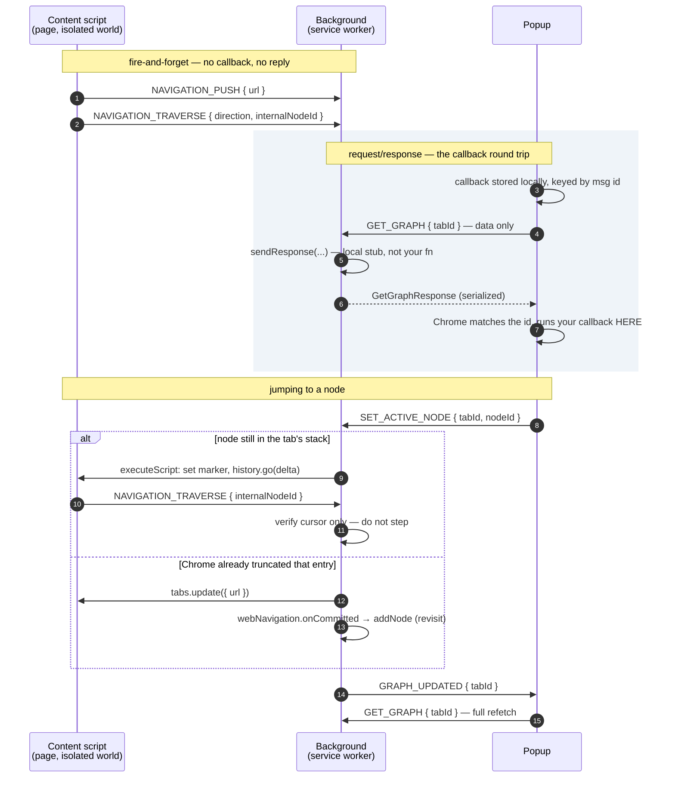

```mermaid
sequenceDiagram
    autonumber
    participant CS as Content script<br/>(page, isolated world)
    participant BG as Background<br/>(service worker)
    participant PU as Popup

    Note over CS,BG: fire-and-forget — no callback, no reply
    CS->>BG: NAVIGATION_PUSH { url }
    CS->>BG: NAVIGATION_TRAVERSE { direction, internalNodeId }

    rect rgba(120,160,200,0.12)
    Note over PU,BG: request/response — the callback round trip
    PU->>PU: callback stored locally, keyed by msg id
    PU->>BG: GET_GRAPH { tabId } — data only
    BG->>BG: sendResponse(...) — local stub, not your fn
    BG-->>PU: GetGraphResponse (serialized)
    PU->>PU: Chrome matches the id, runs your callback HERE
    end

    Note over PU,CS: jumping to a node
    PU->>BG: SET_ACTIVE_NODE { tabId, nodeId }
    alt node still in the tab's stack
        BG->>CS: executeScript: set marker, history.go(delta)
        CS->>BG: NAVIGATION_TRAVERSE { internalNodeId }
        BG->>BG: verify cursor only — do not step
    else Chrome already truncated that entry
        BG->>CS: tabs.update({ url })
        BG->>BG: webNavigation.onCommitted → addNode (revisit)
    end
    BG->>PU: GRAPH_UPDATED { tabId }
    PU->>BG: GET_GRAPH { tabId } — full refetch
```