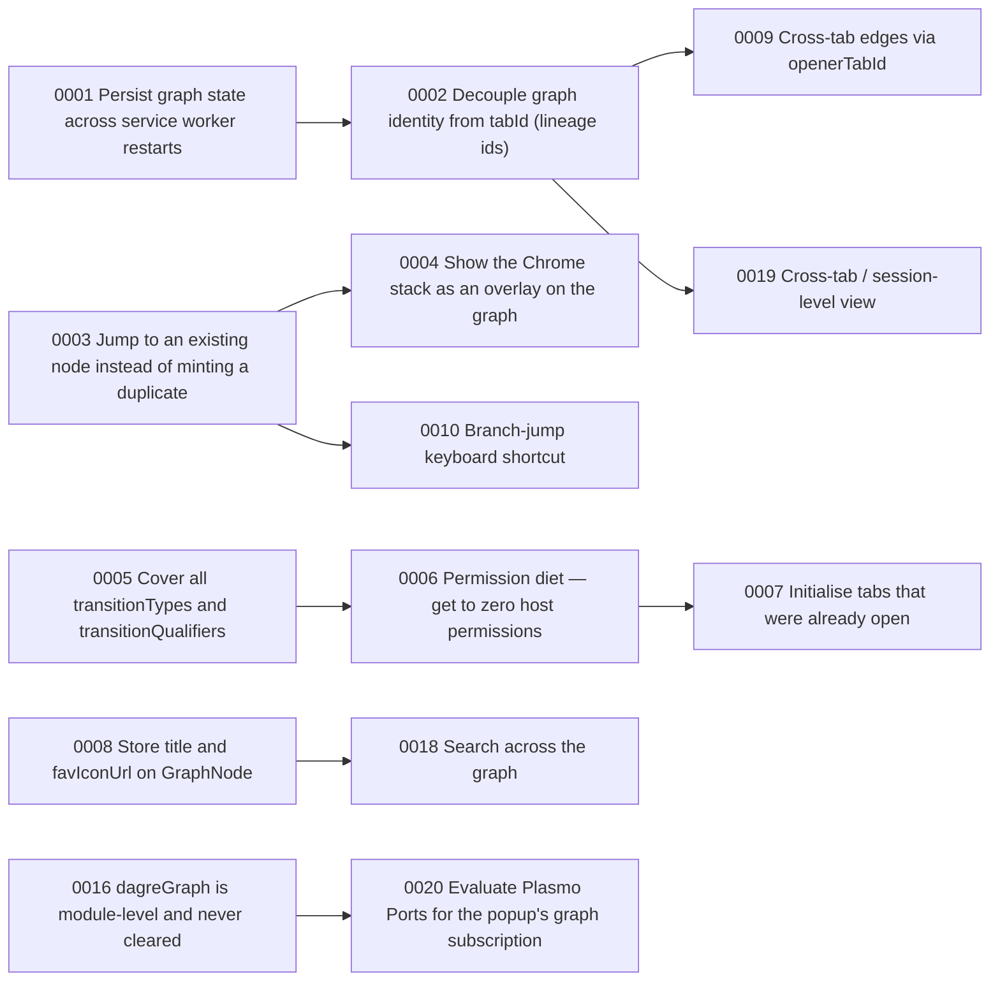

<!-- Generated by tasks/build-index.mts - do not edit. Run `pnpm tasks` after changing any item. -->

# Task index

20 open · 1 done · updated 2026-09-15

## In progress (1)

| id | task | priority | area | blocked by |
| --- | --- | --- | --- | --- |
| [0003](items/0003-jump-to-existing-node.md) | Jump to an existing node instead of minting a duplicate | high | background | — |

## Ready (10)

No unfinished dependencies - pick from the top.

| id | task | priority | area | blocked by |
| --- | --- | --- | --- | --- |
| [0001](items/0001-persist-graph-state.md) | Persist graph state across service worker restarts | critical | background | — |
| [0005](items/0005-transition-coverage.md) | Cover all transitionTypes and transitionQualifiers | high | background | — |
| [0008](items/0008-node-title-favicon.md) | Store title and favIconUrl on GraphNode | medium | graph | — |
| [0011](items/0011-popup-focus-active-node.md) | Popup does not zoom to the active node | medium | popup | — |
| [0012](items/0012-traverse-bounds-check.md) | Graph.traverse needs bounds checking | medium | graph | — |
| [0013](items/0013-delete-navigation-session.md) | Delete tabToNavigationSession and the NavigationSession type | medium | graph | — |
| [0014](items/0014-popup-full-view.md) | Open the graph in a full tab view | medium | popup | — |
| [0015](items/0015-launch-readiness.md) | Launch readiness | medium | release | — |
| [0016](items/0016-dagre-graph-per-call.md) | dagreGraph is module-level and never cleared | low | graph | — |
| [0017](items/0017-export-graph-json.md) | Export the graph to JSON | low | popup | — |

## Blocked (9)

Waiting on the dependency in the last column.

| id | task | priority | area | blocked by |
| --- | --- | --- | --- | --- |
| [0002](items/0002-lineage-ids.md) | Decouple graph identity from tabId (lineage ids) | critical | background | `0001` |
| [0004](items/0004-stack-overlay.md) | Show the Chrome stack as an overlay on the graph | high | popup | `0003` |
| [0006](items/0006-permission-diet.md) | Permission diet — get to zero host permissions | high | manifest | `0005` |
| [0007](items/0007-initialise-open-tabs.md) | Initialise tabs that were already open | high | background | `0006` |
| [0009](items/0009-cross-tab-edges.md) | Cross-tab edges via openerTabId | medium | background | `0002` |
| [0010](items/0010-branch-jump-shortcut.md) | Branch-jump keyboard shortcut | medium | background | `0003` |
| [0018](items/0018-graph-search.md) | Search across the graph | low | popup | `0008` |
| [0019](items/0019-session-level-view.md) | Cross-tab / session-level view | low | popup | `0002` |
| [0020](items/0020-plasmo-ports.md) | Evaluate Plasmo Ports for the popup's graph subscription | low | architecture | `0016` |

## Done (1)

| id | task | priority | area | blocked by |
| --- | --- | --- | --- | --- |
| [0022](items/0022-remove-plasmo-boilerplate.md) | Remove shipped Plasmo boilerplate | high | manifest | — |

## Won't do (1)

| id | task | priority | area | blocked by |
| --- | --- | --- | --- | --- |
| [0021](items/0021-sync-multi-device.md) | Sync / multi-device / sharing | low | product | — |

## Dependency graph

